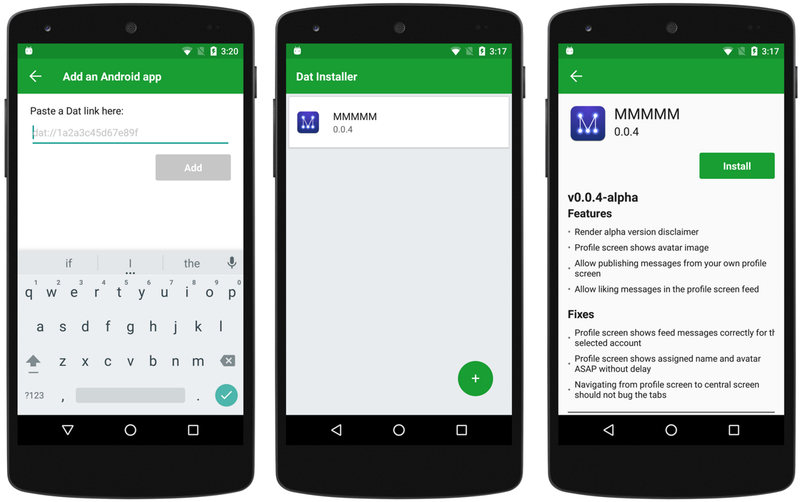

# Dat Installer

> Download, install, and update Android apps through [Dat](https://datproject.org/)


**[Download Dat Installer's APK](https://github.com/staltz/dat-installer/releases)**

The new decentralized internet needs mobile app distribution channels. Dat Installer is the answer for Android apps, working as a decentralized "Play Store" minus the "Store" part (discovery of apps and monetization). With Dat, apps can be shared peer-to-peer, either locally or globally, with or without access to the old internet.

With Dat Installer you can insert a Dat link where you expect the APK file to be, and this app will download the APK and make it easy for you to install it right away (as well as update, in the future).



One such app you can install through this is [Manyverse](https://gitlab.com/staltz/manyverse), just paste the following Dat link into Dat Installer:

```
dat://manyverse-latest.hashbase.io
```

or the Dat hash address:

```
dat://520a00daf0a309bef7722b3f3338854e9da667d01e48dc7b83b118d86354d6d3
```

You can also install (actually update) Dat Installer through Dat Installer! 😵

```
dat://dat-installer-latest.hashbase.io
or
dat://8c23f9eb1f09b5980d12bbd2150a07c8bae1b281f1f58d7ca9bef829634388d5
```

## Publishing an app

If you are building an Android app and would like to distribute it through Dat, you should have a metadata file named `metadata.json` (exactly this name) with the following contents:

```json
{
  "convention": "1",
  "apk": "/app-release.apk",
  "readme": "/readme.md"
}
```

The `apk` field specifies the path to your APK file in the current Dat directory. Optionally, you can pass a path to the README file under the field `readme`.

## Contributing to this project

Contributions are welcomed. Please read Contributing.md to see what development process this project uses.

The app is developed with:

- [React Native](http://facebook.github.io/react-native)
- [TypeScript](http://www.typescriptlang.org/)
- [Cycle.js](https://cycle.js.org)
- [react-native-node](https://github.com/staltz/react-native-node)
- [dat-node](https://github.com/datproject/dat-node)

`src/backend` contains source code for the background Node.js process, and `src/frontend` contains source code for the React Native GUI app.

The roadmap on what @staltz will do next is described in TODO.md.

## License

GPLv3
